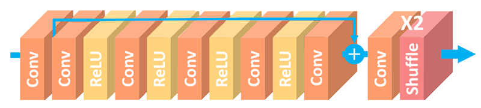

# ArtCNN

## Overview
These are Super-Resolution Convolutional Neural Networks as GLSL shaders for mpv. They implement a simple feed-forward architecture with one long-skip connection and a pixel-shuffle layer to get the HR image.

Two variants of the shader are available:
- `ArtCNN_C4F16.glsl`: This is the main variant with 4 internal convolution layers with 16 filters each.
- `ArtCNN_C4F8.glsl`: This is a smaller and faster variant with only 8 filters per convolution layer.

## Model Architecture


## Instructions
Add something like this to your mpv config:
```
glsl-shader="path/to/shader/ArtCNN_C4F16.glsl"
```
