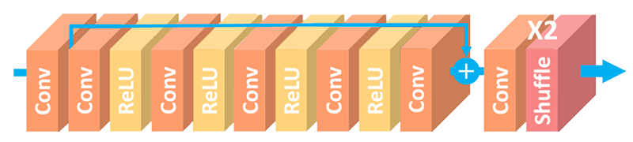
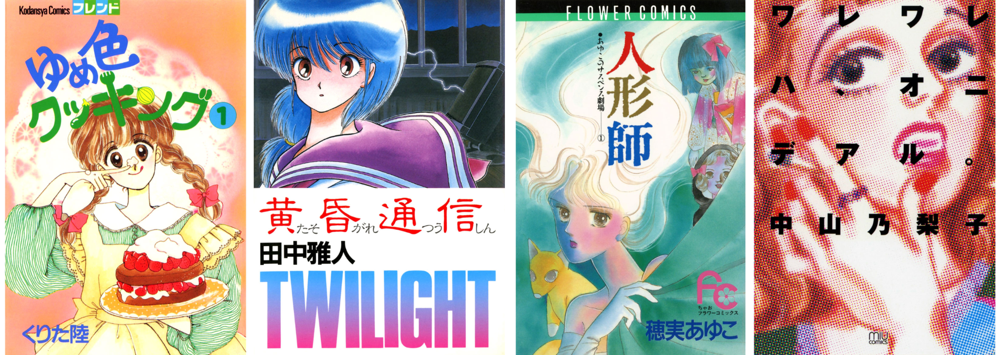
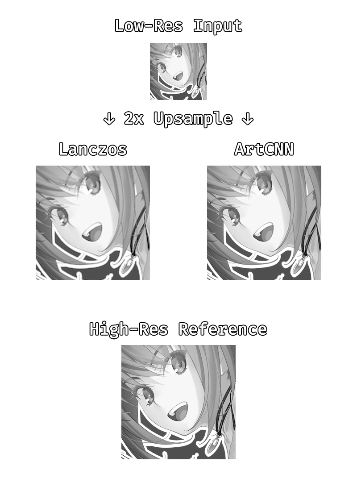

# ArtCNN

## Overview
These are Super-Resolution Convolutional Neural Networks as GLSL shaders for mpv. They implement a simple feed-forward architecture with one long-skip connection and a pixel-shuffle layer to get the HR image.



The main variant of the shader is offered in 3 sizes, these are meant to "respect" the source and generate fairly neutral outputs:
- `C4F32`: This has 4 internal convolution layers with 32 filters each. This is the "big" variant of the shader. This is the best version of the shader for very high quality content, but it is a bit resource-intensive for real-time video playback and you should only consider using it if you have a good GPU.
- `C4F16`: This has 4 internal convolution layers with 16 filters each. This is the "normal" variant of the shader. Most semi-recent discrete GPUs should be able to handle this.
- `C4F8`: This has 4 internal convolution layers with 8 filters each. This is the "small" variant of the shader. You should only use this for performance or power consumption reasons.

A few other variants are also offered, these are meant to cover specific needs:
- `LL`: Trained with images downsampled in linear light. Use this if you suspect the content has been downsampled in linear light.
- `SH`: Trained with LR images that have been downsampled with Hermite. Use this if you want some mild sharpening.
- `DN`: Trained with LR images that have been moderately compressed. Use this to clean compression artifacts at the expense of some fine-detail.
- `DS`: Trained with LR images that have been moderately compressed and downsampled with Hermite. This provides mild artifact cleaning and sharpening, which might work well for low quality web sources.
- `DIV2K`: Trained on the DIV2K dataset. This variant should be a little better on live-action content.

If you plan on using ArtCNN for fractional scaling factors below 2x, the `SH` and `DS` variants might work better with mpv's default downscaling filter `dscale=hermite`. For the other variants, it's recommended that you change the downscaling filter to something sharper to avoid blurrying the image.

`Chroma` variants are 1x YCbCr models in order for them to extract information from luma and not have to deal with chromaloc. They should be used alongside `cscale=bilinear`. The `DN` and `DS` variants should generally work well on most lossy video content, you should only consider the other variants on very high quality sources. You should not use this alongside luma prescalers.

`YCbCr` variants are 2x YCbCr models that expect chroma to have been upscaled with `cscale=bilinear`. This is what you should generally use if you want to reconstruct both luma and chroma with ArtCNN. Do **not** use these on 4:4:4 content.

`RGB` variants are 2x RGB models. These are **not** trained to learn how to reconstruct chroma, they simply double the image. These are the preferred models for RGB or 4:4:4 content in general.

## Technical Details
The shaders are trained on the Manga109 dataset using the Adam optimiser with a learning rate of 1e-4 and the L1/MAE loss function. The dataset is split into smaller 64x64 patches and downsampled with the `box` filter.



You can check the `ArtCNN_Training.ipynb` Colab Notebook for details.

## Instructions
Add something like this to your mpv config:
```
vo=gpu-next
glsl-shader="path/to/shader/ArtCNN_C4F16.glsl"
```

## Example

