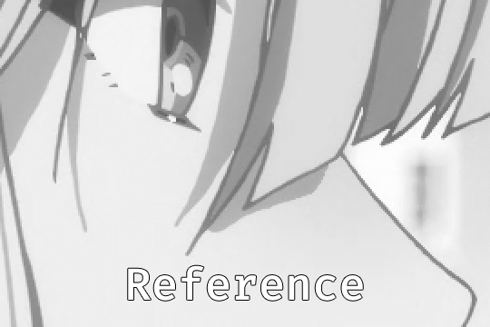

# ArtCNN

## Overview
These are Super-Resolution Convolutional Neural Networks as GLSL shaders for mpv. They implement a simple feed-forward architecture with one long-skip connection and a pixel-shuffle layer to get the HR image.

These shaders are trained on the Manga109 dataset using the Adam optimiser with a learning rate of 1e-4 and the L1/MAE loss function. The high-resolution images are downscaled in linear-light with a box filter, and they're also split into small 64x64 patches for performance and memory reasons.

You can check the `ArtCNN_Training.ipynb` Colab Notebook for details.

The main variant of the shader is offered in 2 sizes:
- `ArtCNN_C4F16.glsl`: This has 4 internal convolution layers with 16 filters each.
- `ArtCNN_C4F8.glsl`: This has 4 internal convolution layers with 8 filters each. This version is faster at the expense of some reconstruction quality (the difference is usually negligible).

Some variants of the smaller C4F8 model are also offered:
- `ArtCNN_C4F8_Gamma.glsl`: Trained with images downsampled in gamma-light. Use this if you suspect the content has been downsampled in gamma-light.
- `ArtCNN_C4F8_Hermite.glsl`: Trained with images downsampled with hermite instead of box. Use this if the content is naturally a bit blurry.

## Model Architecture


## Example


## Instructions
Add something like this to your mpv config:
```
glsl-shader="path/to/shader/ArtCNN_C4F8.glsl"
```
