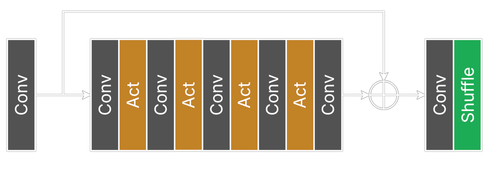
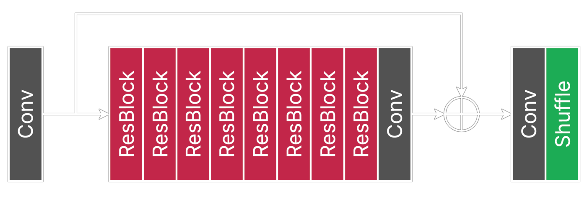
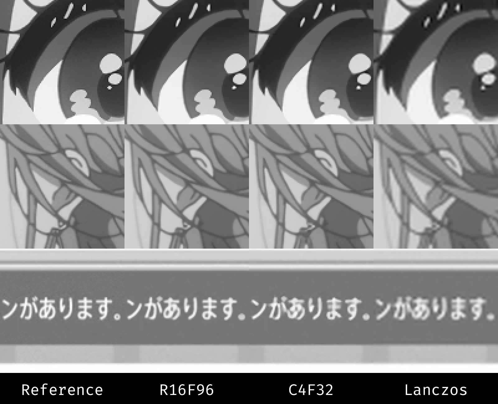

# ArtCNN

## Overview
ArtCNN is a collection of simple SISR CNNs aimed at anime content.

Two distinct architectures are currently offered:
- `C`: Original ArtCNN models optimised mostly for speed. These should only be used for real-time tasks like video playback. The architecture consists of a series of convolution layers aided by a single long-skip connection. Offered in the ONNX format and as GLSL shaders.


- `R`: Bigger models aimed mostly at non real-time tasks like rescaling. On top of having more filters per convolution layer, the architecture was also made much deeper with the help of residual blocks and short-skip connections. Offered only in the ONNX format.


4 configurations are currently offered:

| Model     | Architecture | Residual Blocks/Layers | Filters | Parameter Count | Recommended Usage                                      |
| --------- | ------------ | ---------------------- | ------- | ----------------| -------------------------------------------------------|
| `R16F96`  | R            | 16                     | 96      | ~4m             | Highest-quality reconstruction for non real-time tasks |
| `R8F64`   | R            | 8                      | 64      | ~926k           | Balanced option for non real-time tasks                |
| `C4F32`   | C            | 4                      | 32      | ~48k            | Real-time tasks if hardware allows                     |
| `C4F16`   | C            | 4                      | 16      | ~12k            | Lightweight option for real-time tasks                 |

Regarding the suffixes:
- Models without any suffixes are the baselines. These are neutral luma doublers.
- `DS` variants are trained to denoise and sharpen, which is usually useful for most web sources.
- `Chroma` variants are trained to reconstruct chroma. These are intended to be used on 4:2:0 content and chroma must be upscaled with bilinear.

You may occasionaly find some experimental models under the `Experiments` directory.

## mpv Instructions
Add something like this to your mpv config:
```
vo=gpu-next
glsl-shader="path/to/shader/ArtCNN_C4F32_DS.glsl"
```

## VapourSynth Instructions
ArtCNN is supported by [vs-mlrt](https://github.com/AmusementClub/vs-mlrt), with an easy-to-use wrapper in [vs-jetpack](https://github.com/Jaded-Encoding-Thaumaturgy/vs-jetpack/). Please follow the instructions found there.

Alternatively, can also run the GLSL shaders with [vs-placebo](https://github.com/sgt0/vs-placebo).

## Examples

